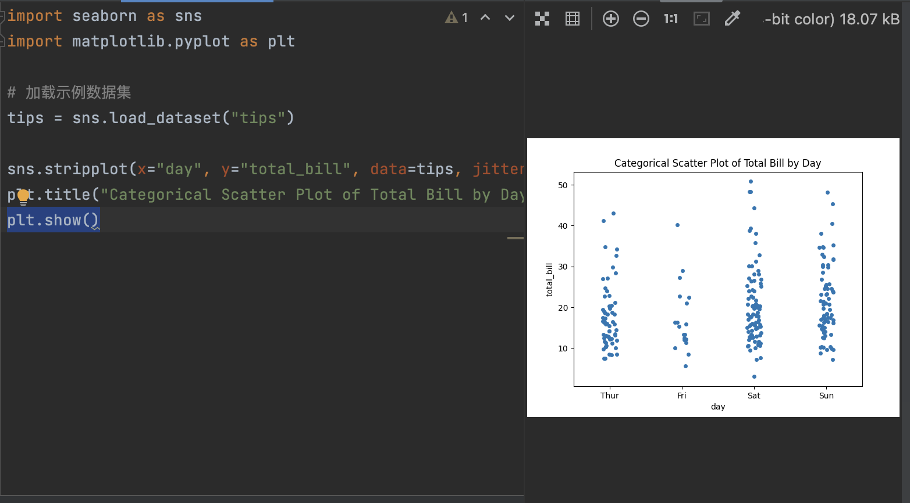
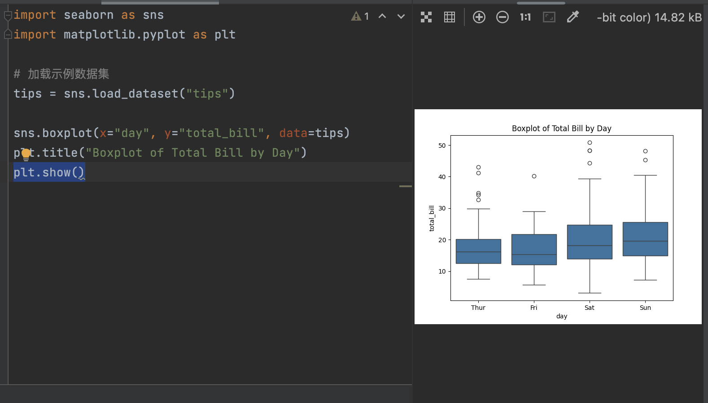
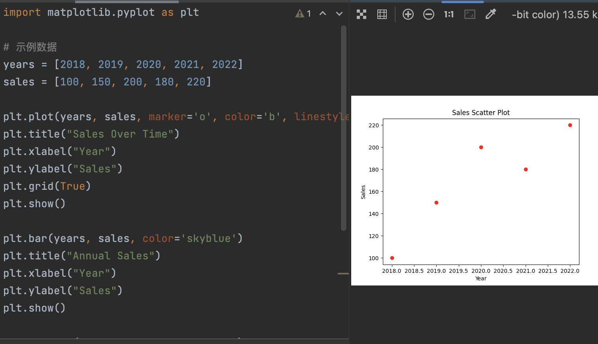
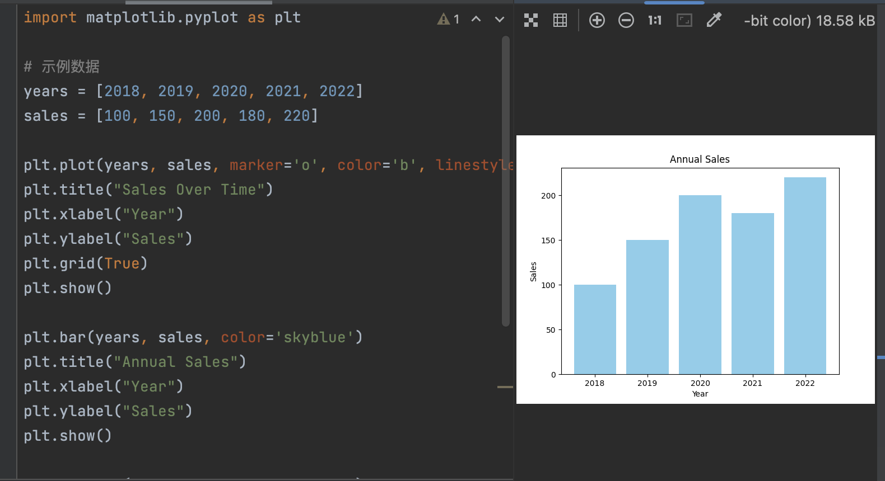
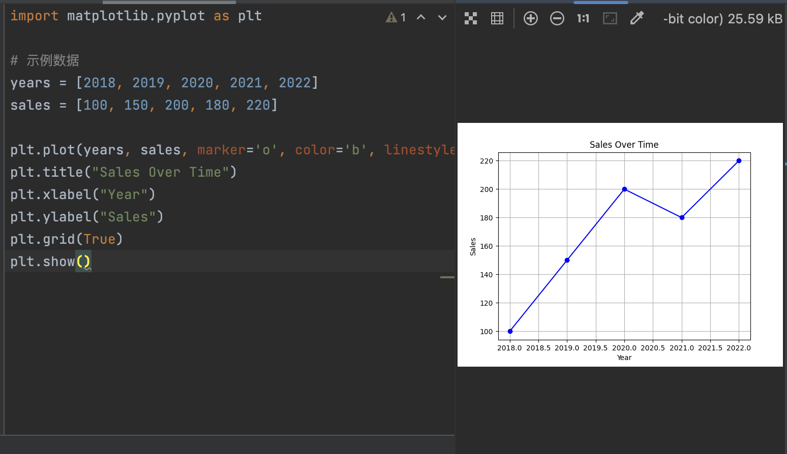

**1. 数据的全生命周期管理包括哪些阶段？**

数据的全生命周期管理（Data Lifecycle Management, DLM）是指对数据从创建到销毁的整个过程进行有效管理，以确保数据的安全性、合规性和可用性。这个过程通常包括以下几个主要阶段：

​	1.	**数据创建与采集（Data Creation and Acquisition）**：

​	•	这一阶段是指数据的产生或获取，包括传感器、手动输入、网络爬虫等各种形式的数据源。确保数据准确和可靠至关重要。

​	2.	**数据存储与维护（Data Storage and Maintenance）**：

​	•	数据一旦被采集，必须以某种形式存储。存储可以是本地的、云端的或分布式的。维护包括数据的备份、恢复，以及持续确保数据的完整性。

​	3.	**数据处理与转换（Data Processing and Transformation）**：

​	•	数据从原始形态转换为可供分析和使用的格式。数据清洗、数据集成、格式转换等都是在这一阶段进行的。

​	4.	**数据分析与利用（Data Analysis and Usage）**：

​	•	这一阶段是数据生命周期的核心。通过各种分析技术和工具，对数据进行挖掘、建模和解读，以支持决策、改善流程或创新。

​	5.	**数据共享与发布（Data Sharing and Publishing）**：

​	•	数据在合适的时候可以共享给其他部门、合作伙伴或公众。这包括数据的开放、API的提供等。

​	6.	**数据归档与保留（Data Archiving and Retention）**：

​	•	某些数据在完成其分析价值后，可能不再经常使用，但仍需长期保存以供将来参考。这一阶段关注如何合理归档、存储和保护旧数据。

​	7.	**数据销毁（Data Deletion and Disposal）**：

​	•	在数据不再有用，或其保留期限结束时，数据应安全销毁，以防止数据泄露或不当使用。

**2. 数据采集的概念是什么？都有哪些方法？**

**数据采集**是指通过各种技术手段从不同的数据源中获取数据的过程。数据采集是数据生命周期的起点，直接影响后续的数据处理和分析质量。

**数据采集的方法：**

​	1.	**手动数据采集**：

​	•	通过人工手动输入数据。这种方法适用于数据量较小且不易自动化采集的场景，如市场调查、问卷填写。

​	2.	**自动化数据采集**：

​	•	通过传感器、应用程序或网络爬虫等方式，自动获取大量数据。例如，物联网设备通过传感器自动采集温度、湿度、压力等数据。

​	3.	**网络数据爬虫**：

​	•	使用网络爬虫（Web Crawler）技术，从互联网中自动获取网页内容和数据。例如，电商网站可能会使用爬虫技术收集竞争对手的商品价格信息。

​	4.	**API数据采集**：

​	•	通过调用外部或内部API接口，系统可以自动化地从其它平台获取数据。例如，金融机构可以通过API接口从市场获取实时股票行情数据。

​	5.	**日志数据采集**：

​	•	应用程序、服务器和系统会生成大量的日志，日志数据包含用户行为、系统状态等。通过对这些日志进行采集，可以帮助企业优化性能、识别潜在问题。

​	6.	**传感器数据采集**：

​	•	常见于物联网（IoT）场景，传感器可以采集环境中的物理参数，如温度、湿度、压力、位移等信息。

​	7.	**卫星和遥感技术**：

​	•	利用卫星影像和遥感技术，可以采集到地理位置、气候变化等大范围的数据，广泛应用于环境监测、农业等领域。

**3. 什么是数据管理？比较传统的数据管理和大数据管理技术有什么异同？**

**数据管理**是指在整个数据生命周期中对数据进行有效的规划、组织、存储、保护、处理和使用的活动。它的目标是确保数据的高效、安全、可用和可靠。

**传统数据管理与大数据管理的异同：**

​	1.	**数据规模**：

​	•	**传统数据管理**：主要处理结构化数据，数据规模相对较小，通常以MB、GB为单位，使用关系型数据库（如MySQL、Oracle）管理。

​	•	**大数据管理**：面对的是PB甚至更大规模的数据，数据可以是结构化、半结构化或非结构化的，关系型数据库在处理这种海量数据时效率低下，因此大数据管理通常使用分布式存储和处理系统，如Hadoop、NoSQL数据库。

​	2.	**数据类型**：

​	•	**传统数据管理**：数据类型相对单一，以结构化数据为主，来自ERP、CRM等企业应用系统。

​	•	**大数据管理**：不仅包括结构化数据，还涵盖了大量的非结构化数据（如文本、图像、视频）和半结构化数据（如XML、JSON）。

​	3.	**数据存储架构**：

​	•	**传统数据管理**：使用集中式存储系统，数据库集中在一台或几台服务器上。

​	•	**大数据管理**：使用分布式存储架构，如HDFS（Hadoop分布式文件系统）、Amazon S3等，以应对数据量大、增长速度快的问题。

​	4.	**数据处理方式**：

​	•	**传统数据管理**：基于批处理的模式，数据量较小且要求实时性不强，处理速度可以相对较慢。

​	•	**大数据管理**：强调实时性和并行处理能力，常用的计算模式包括批处理、流处理和混合模式，以适应实时数据的处理需求。

​	5.	**处理技术**：

​	•	**传统数据管理**：使用关系型数据库SQL，数据处理以表为核心，支持事务处理和复杂查询。

​	•	**大数据管理**：采用多样化的处理框架，如MapReduce、Spark等，并且更多地依赖于非关系型数据库和基于键值对的查询。

​	6.	**数据分析**：

​	•	**传统数据管理**：数据分析主要基于关系数据库的查询和统计功能，通常是对已存储数据的回顾性分析。

​	•	**大数据管理**：支持大规模并行分析，利用机器学习、数据挖掘等技术进行预测性分析和实时分析。

**4. 大数据的计算模式可以分为哪几类？**

大数据计算模式是指在处理大规模数据时所采用的计算方式。根据不同的数据处理需求和技术特点，常见的计算模式有以下几种：

1. **批处理（Batch Processing）**：

​	•	批处理是一种对静态数据进行大规模处理的方式，通常用于对大量数据进行离线处理。常见的批处理框架包括Hadoop的MapReduce和Spark。优点是能够处理大规模数据集，但缺点是实时性差。

​	2.	**流处理（Stream Processing）**：

​	•	流处理是在数据实时产生的过程中对其进行处理的模式。适合用于处理持续产生的数据流，如物联网传感器数据、实时社交媒体数据等。常见的框架有Apache Storm、Apache Flink、Spark Streaming等。流处理强调低延迟和高吞吐量。

​	3.	**微批处理（Micro-Batching）**：

​	•	微批处理介于批处理和流处理之间，将数据分成多个小批次来处理。Spark Streaming采用的就是这种方式。它结合了批处理的高效性和流处理的实时性。

​	4.	**混合处理（Hybrid Processing）**：

​	•	混合处理结合了批处理和流处理的优势，能够同时处理历史数据和实时数据。Lambda架构就是这种模式的典型代表，它通过批处理来处理大数据的历史部分，通过流处理来处理实时数据。

​	5.	**边缘计算（Edge Computing）**：

​	•	在边缘设备上进行数据处理，减少数据传输到中央服务器的负载，适用于分布式环境和物联网场景。

**5. 什么是数据分析？有哪些数据分析的方法或者模型？**

**数据分析**是指通过对数据进行清洗、整理、建模，从而提取有用信息，帮助决策和问题解决的过程。数据分析不仅仅是对数据的描述，还包括预测、优化等更深层次的操作。

**数据分析的方法或模型：**

​	1.	**描述性分析（Descriptive Analytics）**：

​	•	描述过去发生的事件，通过对数据的统计和可视化，发现数据中的趋势和模式。例如，统计用户的购买行为，了解市场的变化趋势。

​	2.	**诊断性分析（Diagnostic Analytics）**：

​	•	诊断性分析旨在解释为什么某种现象发生。例如，采用回归分析等方法，找到销售量下降的原因。

​	3.	**预测性分析（Predictive Analytics）**：

​	•	通过机器学习、时间序列分析等方法，预测未来可能发生的情况。例如，基于历史数据预测未来的销售趋势。

​	4.	**规范性分析（Prescriptive Analytics）**：

​	•	规范性分析通过优化算法和模型，给出最优的行动建议。例如，采用线性规划或仿真技术，为企业提供库存管理的最佳方案。

​	5.	**探索性分析（Exploratory Data Analysis, EDA）**：

​	•	这是数据分析的初步步骤，通过绘制图表、计算统计指标来发现数据的结构和规律，不强调建模。

​	6.	**聚类分析（Cluster Analysis）**：

​	•	通过将数据分为不同的组别，找到数据之间的相似性。例如，消费者行为分析中，根据用户特征进行分群。

​	7.	**关联分析（Association Analysis）**：

​	•	关联分析寻找数据集中的规则和模式，最著名的是“啤酒与尿布”的购物篮分析。

​	8.	**因果分析**：

​	•	因果分析是为了探索数据中的因果关系。比如，使用AB测试来评估某项营销活动对销售的影响。

**6. 数据可视化的原因有哪些？**

数据可视化是将数据以图表、图形、地图等形式展示出来，目的是帮助用户直观地理解和分析数据。其原因包括：

​	1.	**增强数据理解**：

​	•	人类大脑对图像的理解速度比文字更快。通过可视化，复杂的数据关系和模式可以更快被理解，帮助管理者和分析人员更好地做出决策。

​	2.	**发现隐藏的模式和趋势**：

​	•	数据中可能存在一些隐藏的规律和趋势，这些通过单纯的表格数据难以发现。通过数据可视化，可以更容易地观察到这些规律。

​	3.	**提高数据的透明度**：

​	•	可视化使得数据更加透明，便于不同背景和专业的人快速理解数据背后的故事。

​	4.	**支持决策**：

​	•	可视化有助于清晰呈现分析结果，帮助决策者更快作出反应。例如，在市场趋势图上，可以直观地看出哪个产品的销售正在下滑，从而及时调整策略。

​	5.	**更好的沟通**：

​	•	在企业内部或与外部合作伙伴沟通时，图形化的数据报告往往更直观，减少了信息的误解与传递障碍。

​	6.	**提高数据的可操作性**：

​	•	通过数据可视化，用户可以更容易识别出需要采取行动的领域，进而提高数据的可操作性。

